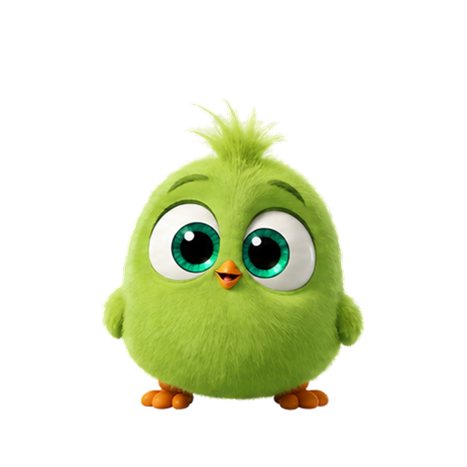

# 咕咕叽桌面宠物

一只透明背景、始终置顶的 Windows 绿色小鸟桌面宠物。

## 功能

- 安装了 ChatGPT/Codex 时，跟随对话展示“思考 → 工作 → 完成”动画。
- 没有安装 ChatGPT/Codex 时，自动作为普通桌面宠物运行。
- 支持拖动位置、三档大小、暂停动画和手动切换状态。
- 默认登录 Windows 后静默启动，可通过右键菜单关闭。
- 完全本地运行，不联网，也不读取聊天内容。

## 安装

从 GitHub Releases 下载最新的 `咕咕叽桌面宠物-安装包`，双击安装即可。

安装包目前没有商业代码签名。Windows 若显示“未知发布者”，请确认文件来自本仓库后，选择“更多信息 → 仍要运行”。

## 手动运行

系统要求：Windows 10/11，系统自带 Windows PowerShell 5.1。

1. 下载或克隆仓库。
2. 双击 `启动绿色小鸟.bat`。
3. 右键小鸟可切换状态、调整大小或退出。

## 构建安装包

安装 Inno Setup 6 后，编译 `installer/GreenBirdPet.iss`。生成文件位于 `dist` 目录。

---

如有引用，须注明来源，谢谢。
